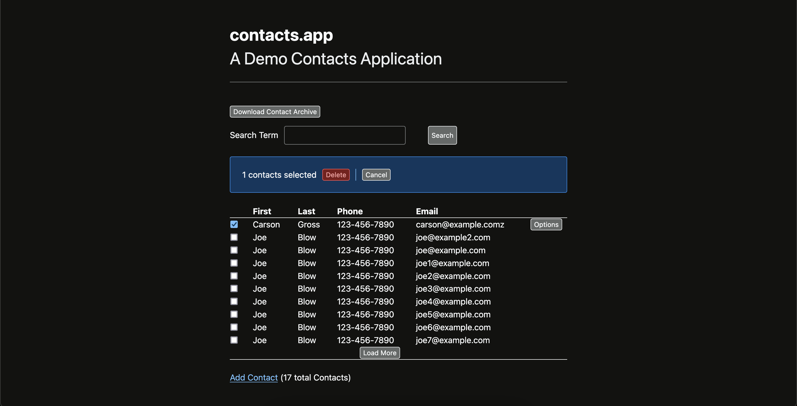

# HTMX Contact App

This is the Go implementation of Contact.app from the [Hypermedia Systems book](https://hypermedia.systems/).



I used this project primarily as a means of testing my custom [HTTP Router](https://gitlab.com/romalor/roxi) and [Radix Tree](https://gitlab.com/romalor/radix) libraries.

# Usage

To start the app:
```bash
make
```
